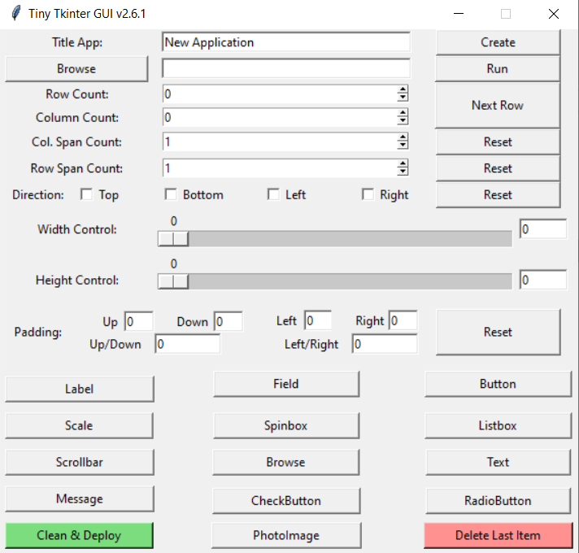
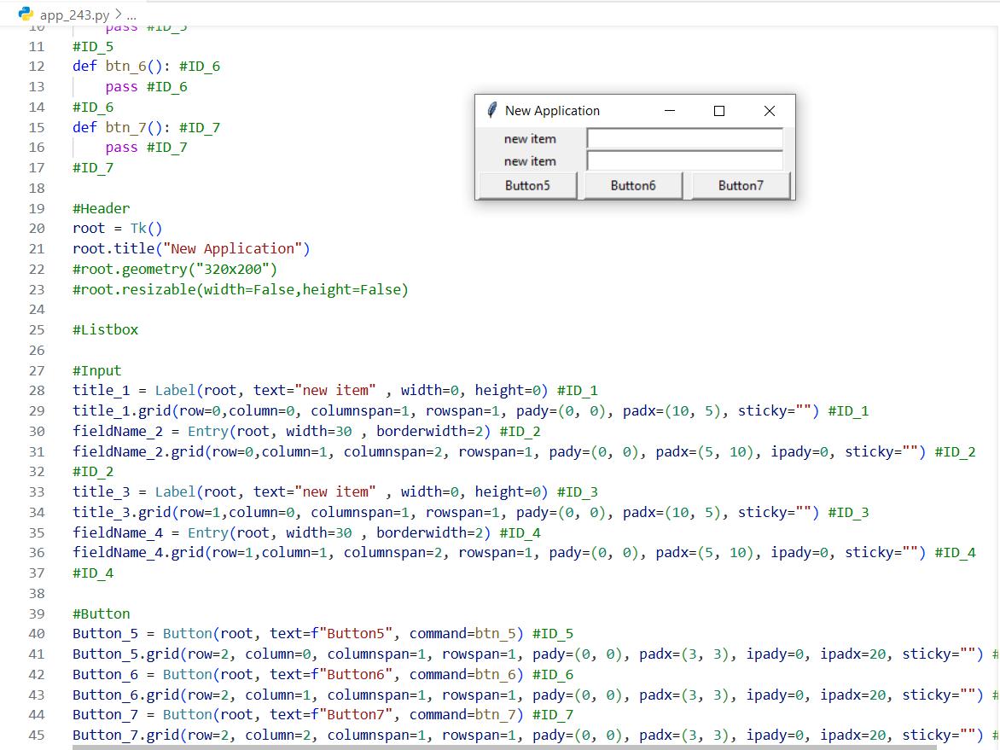

# 🧱 Tiny Tkinter GUI Builder

**Tiny Tkinter GUI** is a visual code generator built with pure Python and Tkinter. It allows you to **create fully functional Python GUI programs** by just clicking buttons — no manual coding required!

🌀 Generate `.py` files, add widgets like Labels, Buttons, Entry fields, Listboxes, Checkbuttons, Images, and more — all with one click.

[](LICENSE)
[](https://github.com/Shahdadkh/tiny-tkinter-gui)

---

## ✨ Features

- 🔨 **Generate complete `.py` files** using pure `tkinter`
- 🎛 Add standard widgets:
  - Label, Entry, Button
  - Listbox, Scrollbar
  - Scale, Spinbox, Text, Message
  - Checkbutton, Radiobutton
  - PhotoImage (PNG/GIF support)
  - File Browse button
- 📐 Layout control:
  - Grid system (row/column)
  - Padding: up/down/left/right
  - Sticky directions: `n`, `s`, `e`, `w`
- 🔁 Auto-increment placement (row/column)
- 🚀 Auto reload with `Run.py` file (monitors file and restarts on change)
- 🧼 Remove last added widget by tracking `#ID_x` blocks
- 📁 Files are well-commented, editable, and human-readable
- 🧼 One-click "Clean & Deploy" feature to generate a clean version of your app:
  - Removes all internal tracking comments like `#ID_x`
  - Creates a new output file prefixed with `out_` (e.g., `out_app_123.py`)
  - Produces clean, production-ready Python Tkinter code
  - Keeps your original generated file intact
  - Helps you quickly prepare your project for sharing or deployment

---

## 📷 Screenshots




## 🛠 How to Use

1. Run `TinyTkinter.pyw`
2. Enter a title and click **Create** to generate a new file (e.g., `app_123.py`)
3. Choose:
   - Widget size (width × height)
   - Grid position (row, column)
   - Padding (top/bottom, left/right)
   - Sticky directions (north/south/east/west)
4. Click any widget button (Label, Entry, etc.) to add it to the file
5. Click **Run** to execute and auto-monitor the generated file
6. Use **Remove** to undo the last added widget

All widgets and functions are injected at specific hashtags like `#Button`, `#Input`, `#End`, making the output clean and modifiable.

---

## 📦 Installation

Clone the repo:

```bash
git clone git@github.com:Shahdadkh/tiny-tkinter-gui.git
cd tiny-tkinter-gui
python TinyTkinter.pyw

```

Note: .pyw files run without opening a console window.

---

## 📝 License

This project is licensed under the **GNU General Public License v3.0 (GPL-3.0)**.  
See the [LICENSE](LICENSE) file for full details.

## 🤝 Contributions

Contributions are welcome!  
Feel free to **fork** the repository, **open issues**, or **submit pull requests** to help improve this project.

## 📞 Contact

Created by [Shahdad Kh](https://github.com/Shahdadkh)  
For questions, ideas, or collaboration — feel free to reach out via GitHub.

## 🔍 Keywords

`tkinter`, `GUI builder`, `code generator`, `visual editor`, `python`, `desktop app`
